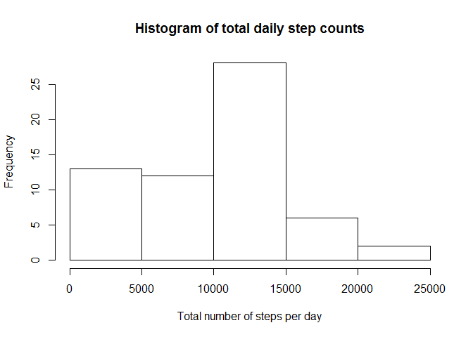
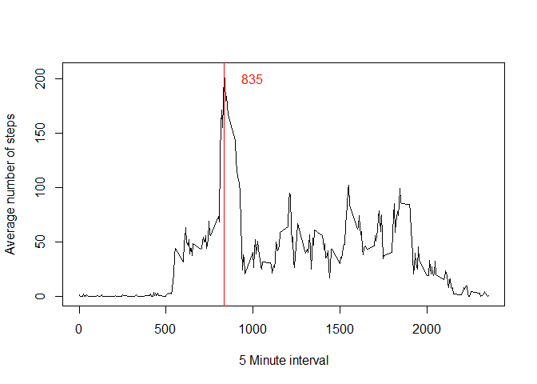
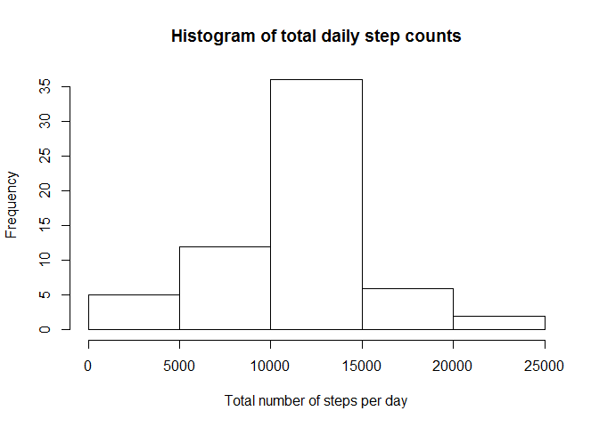
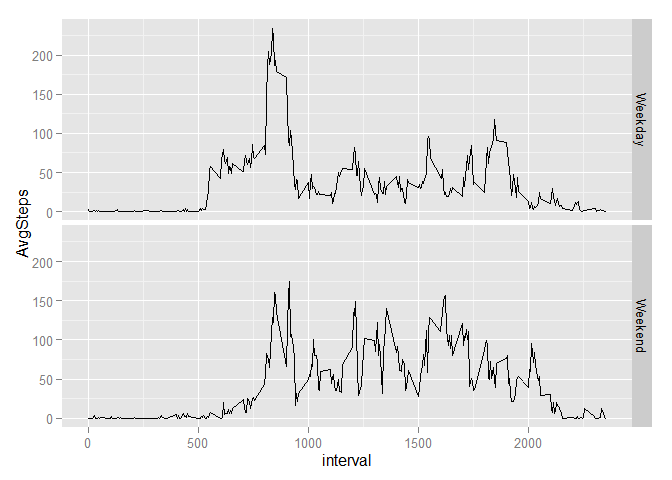

# Reproducible Research: Peer Assessment 1

## Loading and preprocessing the data

First, we will download the zip file from the Coursear web site at https://d396qusza40orc.cloudfront.net/repdata%2Fdata%2Factivity.zip

Then we will unzip the file and read the csv into the Global Environment


```r
#url <- "https://d396qusza40orc.cloudfront.net/repdata%2Fdata%2Factivity.zip"
#download.file(url, destfile = "zipDataFile.zip")
#unzip(zipfile = zipDataFile)
workingData <- read.csv("activity.csv", colClasses = c("integer", "POSIXct", "integer"))
```

## Step count distributions by day
Now, using the dplyr package, we will summarize the total number of steps taken per day.

We will then render a histogram plotting the frequency of total counts, and calculate and display the mean and median total count values.

...If you do not have the dplyr package installed, please install it and re-run this Rmd file


```r
library(dplyr)
```

```
## 
## Attaching package: 'dplyr'
## 
## The following objects are masked from 'package:stats':
## 
##     filter, lag
## 
## The following objects are masked from 'package:base':
## 
##     intersect, setdiff, setequal, union
```

```r
stepsPerDay <- group_by(workingData, date) %>%
    summarize(totalSteps = sum(steps, na.rm = TRUE))
hist(stepsPerDay$totalSteps, 
     xlab = "Total number of steps per day", 
     main = "Histogram of total daily step counts")
```

 


```r
meanSteps <- mean(stepsPerDay$totalSteps, na.rm = TRUE)
medianSteps <- median(stepsPerDay$totalSteps, na.rm = TRUE)
```

The mean number of total steps taken per day is 9354.2295082.

The median number of total steps taken per day is 10395.

## average daily activity pattern

We now want to look at the average number of steps taken in each of the 5-minute intervals daily.

Again using dplyr, we will summarize this set and render a time series plot with an abline and textually represented value for the 5-minute interval which represents the max average number of steps.


```r
intervalAverages <- group_by(workingData, interval) %>%
    summarize(AvgSteps = mean(steps, na.rm = TRUE))
plot(intervalAverages$interval, 
     intervalAverages$AvgSteps, 
     type = "l", 
     xlab = "5 Minute interval", 
     ylab = "Average number of steps")
abline(v = filter(intervalAverages, AvgSteps == max(AvgSteps))[1], col = "red")
text(1000, 200, filter(intervalAverages, AvgSteps == max(AvgSteps))[1], col = "red")
```

 

## Inputing missing values

We will now take a closer look at the missing values, starting with the number of rows missing values:


```r
nrow(workingData) - sum(complete.cases(workingData))
```

```
## [1] 2304
```

Let's now fill in the NA values with the mean values of their corresponding 5-minute interval.


```r
filledData <- workingData
for(i in intervalAverages$interval){
    replaceSet <- filledData$interval == i & is.na(filledData$steps)
    filledData[replaceSet, ]$steps <- intervalAverages[intervalAverages$interval==i,]$AvgSteps
}
newStepsPerDay <- group_by(filledData, date) %>%
    summarize(totalSteps = sum(steps, na.rm = TRUE))
hist(newStepsPerDay$totalSteps, 
     xlab = "Total number of steps per day", 
     main = "Histogram of total daily step counts")
```

 

```r
newMeanSteps <- mean(newStepsPerDay$totalSteps, na.rm = TRUE)
newMedianSteps <- median(newStepsPerDay$totalSteps, na.rm = TRUE)
```

The new mean number of total steps taken per day is 1.0766189\times 10^{4}.  That represents an increase of 1411.959171.

The new median number of total steps taken per day is 1.0766189\times 10^{4}.  That represents an increase of 371.1886792.

This also changes the Standard Deviation of total steps per day from 5405.8950952 to 3974.390746; a net -26.4804315% change

## Are there differences in activity patterns between weekdays and weekends?

We will now take a look at the distribution of activity based on day of week.  This section requires use of the ggplot2 library.  If you do not have this library installed, please do so and re-run this Rmd file.


```r
library(ggplot2)
```

```
## Warning: package 'ggplot2' was built under R version 3.2.2
```

```r
workingData <- mutate(workingData, DayofWeek = weekdays(date))
weekendSet <- workingData$DayofWeek=="Saturday"|workingData$DayofWeek=="Sunday"
workingData[weekendSet,]$DayofWeek<-"Weekend"
workingData[!weekendSet,]$DayofWeek<-"Weekday"
workingData <- group_by(workingData, DayofWeek, interval) %>%
    summarize(AvgSteps = mean(steps, na.rm = TRUE))
qplot(interval, AvgSteps, data = workingData, facets = DayofWeek~., geom = "line")
```

 
